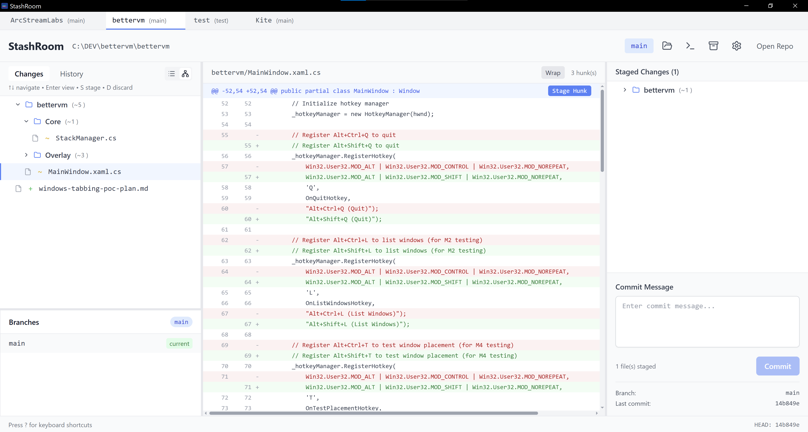
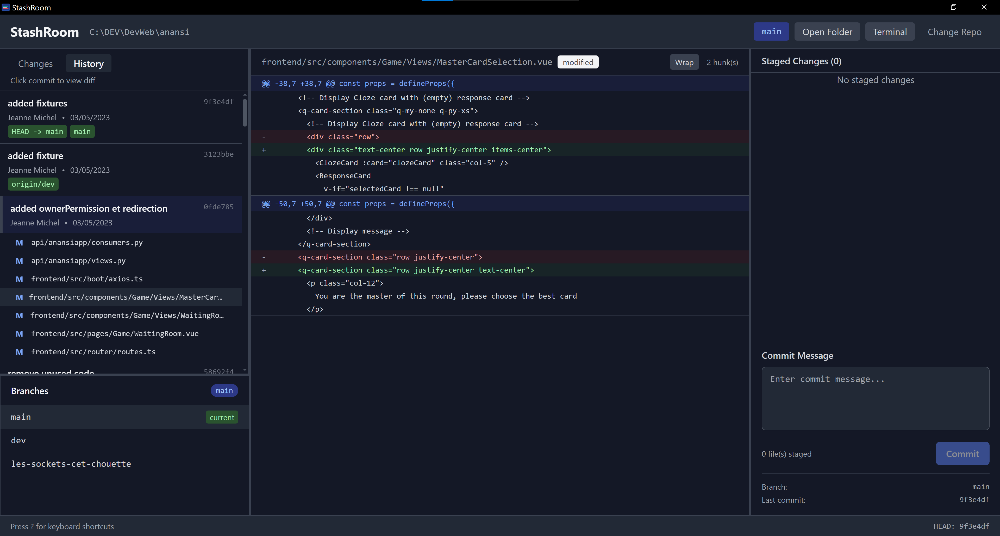

# StashRoom

A modern desktop Git client built with Rust (Tauri) + React + TypeScript.


## Features

- **Three-Panel Interface**: Unstaged changes, diff viewer, staged changes + commit
- **Multi-Repository Support**: Open and manage multiple repositories simultaneously with tab-based interface
- **Persistent Workspace**: Automatically restores open repositories and settings across app restarts
- **Fast**: Virtualized lists handle 10,000+ files smoothly
- **Keyboard-First**: Navigate, stage, commit without touching the mouse
- **Hunk Staging**: Stage individual hunks or specific lines from hunks
- **Safe Discard**: Automatic backups before discarding changes
- **Live Updates**: Filesystem watching with auto-refresh per repository
- **Commits History**: Visualize all commits and changes
- **Branch Management**: Switch between local branches and view branch information
- **Universal Search**: Quick search (Ctrl+P) to find files across commit history with fuzzy matching
- **Theme Support**: Light, dark, and system theme options
- **Compact Mode**: Space-efficient UI option for smaller screens

## Quick Start

```bash
# Install dependencies
npm install

# Run in development mode
npm run tauri dev

# Build for production
npm run tauri build
```

See [QUICKSTART.md](./QUICKSTART.md) for detailed instructions.

## Screenshots

### Main Interface





## Tech Stack

### Backend (Rust)
- **Tauri 2**: Desktop framework
- **git2 (libgit2)**: Git operations
- **notify**: Filesystem watching
- **anyhow**: Error handling

### Frontend (TypeScript/React)
- **React 18**: UI framework
- **Zustand**: State management
- **Tailwind CSS**: Styling
- **react-virtuoso**: Virtualized lists
- **react-resizable-panels**: Resizable layout
- **sonner**: Toast notifications

## Keyboard Shortcuts

| Key | Action |
|-----|--------|
| `?` | Show keyboard shortcuts help |
| `Ctrl+P` | Universal quick search |
| `Ctrl+,` | Open settings |
| `↑` / `↓` | Navigate file list |
| `Enter` | View file diff |
| `S` | Stage/unstage selected file |
| `D` | Discard changes (with backup) |
| `Esc` | Close modals |

---

**Built with ❤️ using Rust, React, and TypeScript**
